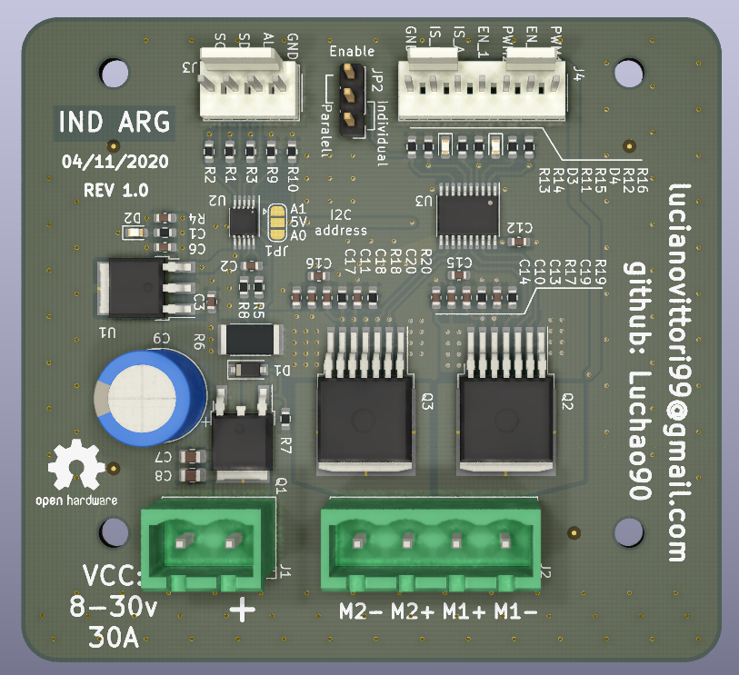

# DC MOTOR CONTROL

This work is realize in context of "pcb design" course from embedded system career FIUBA 2020, for [NOVOTEC](https://www.novotecargentina.com/ofertas.php) company.

# Be careful - NOT TESTED YET.

## SPECS

* Input: 8-30V @30A depends on motor or LOAD.
* PWM Frequency: 30KHz max.
* Outputs: 1 DC motor bi directional or 2 DC motor uni directional.
* Alternative: Any kind of PWM control like lamp dimmer for example.
* Control interface: I2C, PWM and ADC.

## Schematic 

